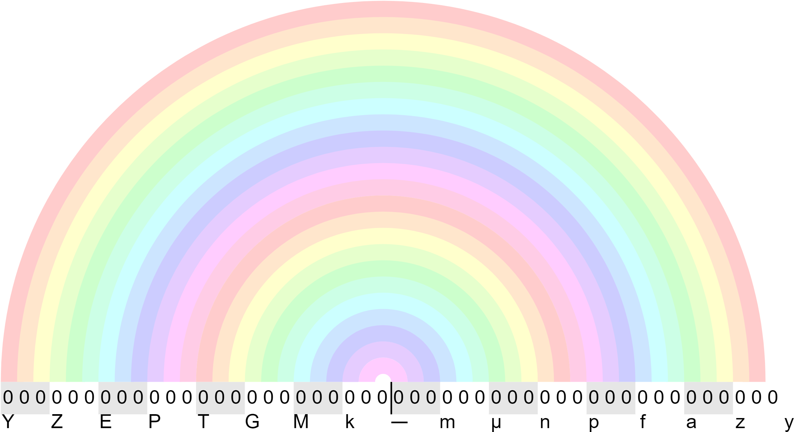

# SI Prefix Rainbow

## What's this?

A visualization of how SI unit prefixes relate to each other.

## How is this useful?

Well, you could use it as a cheat sheet to convert from frequency to period.

Or just enjoy the colors.